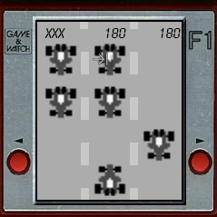

# formula 1
   

  

Formula 1 Game & Watch is a small, fictive formula 1 game & watch style lcd game with high score keeping. The Game was initially created over a decade ago for a small retrogame competition, after which it got ported to the gp2x. This version is based on the gp2x version but with added high score saving.

## Playing the Game
The aim of the game, is to avoid hitting other traffic coming down the screen, you do this by moving your car on the bottom left or right. 

## Controls funkey
Dpad Move Player car left or right
A or B Start a new game at the boot or gameover screen
Menu button quits the game

